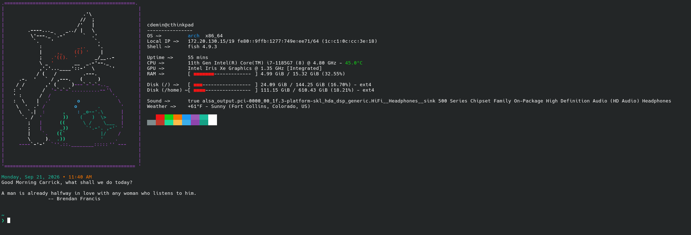

# simple-fish-dotfiles
My custom rice of fish's config files.

###
All you need for this to work is fish, fastfetch, fortune-mod, and starship installed; all of which are availiable in the AUR.

###
Place in ~/.config/fish/config.fish and ~/.config/fastfetch or your custom config path.

